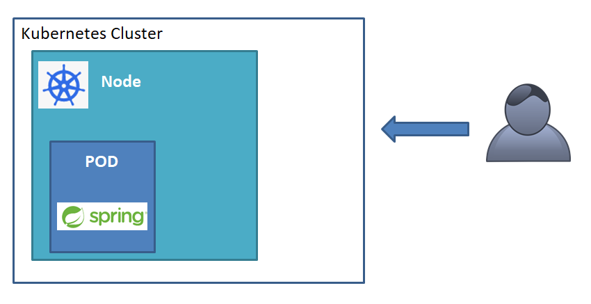

# Kubernetes Commands
Kubernetes is an open source container orchestration engine for automating deployment, scaling, and management of containerized applications.

### POD


## kubectl
```
kubectl cluster-info
kubectl create namespace
kubectl run nginx --image nginx
kubectl get pods
kubectl get nodes
```


## Key Concepts
- **Node:** Is a worker machine
- **Kubelet:** Agent that run's on the server or worker nodes
- **kubectl:** Kube control tool 
- **Pod:** Its a single instance of an application


## Links:
- https://kubernetes.io/docs/home/
- https://kubernetes.io/docs/reference/kubectl/cheatsheet/
